_Continuously updating..._

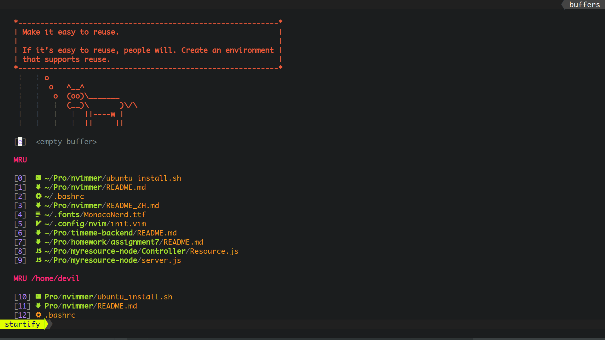

# NVimmer(EN)

[中文说明](README_ZH.md)

A simple, fast and efficient **VIM IDE Configuration**, it is especially nice for the full stack developers on Linux.

With Monaco nerd font on Linux.

NVimmer is a new version of [Vimmer](https://github.com/devilyouwei/Vimmer). The configuration of NVimmer will be based on NeoVim instead of Vim.

For **Windows** [Click Here](https://github.com/devilyouwei/Vimmer)

For **Mac** [iVimmer](https://github.com/husterlf/iVimmer)

## Support

1. HTML CSS JS
2. Java
3. C#
4. vue
5. TypeScript
6. PHP
7. C/C++
8. Markdown
9. JSON
10. Wechat wxml
11. react js/jsx/tsx
12. Kotlin
13. English Words
14. Emoji (type `:` select emoji)

Attention: NVimmer will use **Prettier and eslint** as the default linter and formatter for the fontend!

## [Recommended] Ubuntu/Deepin Onekey Install 🚤 🚤 🚤

Execute the following commands, install everything! ✌

🌟 **curl [recommend]**

```bash
curl -o ubuntu_install.sh https://raw.githubusercontent.com/devilyouwei/NVimmer/master/ubuntu_install.sh && bash ubuntu_install.sh
```

**wget**

```bash
wget https://raw.githubusercontent.com/devilyouwei/NVimmer/master/ubuntu_install.sh && bash ubuntu_install.sh
```

**Script Fail**

-   During the process of installations, the script may fail to download something, especially in China.
-   If the script is interrupted or exit with errors, please run it again, until it success, or try to change the network environment.
-   After all the installations are finished, if nvim still doesn't work well, same with point 2, try again!
-   For the first time to start nvim, please restart terminal and then reopen nvim.

**Monaco Nerd Fonts**

Use wget (must) to download the font, and then open a terminal preference to config the font to `Monaco Nerd Font`

```bash
wget https://github.com/devilyouwei/linux-font/blob/master/Monaco/Nerd/YaheiMonacoNerd.ttf?raw=true -O ~/.fonts/MonacoNerdMono.ttf

fc-cache -vf
```

Or, You would like to download and install the font manually.

[Download Monaco Nerd Font](https://github.com/devilyouwei/linux-font/blob/master/Monaco/Nerd/MonacoNerdMono.ttf)

## Examples :tada: :tada: :tada:

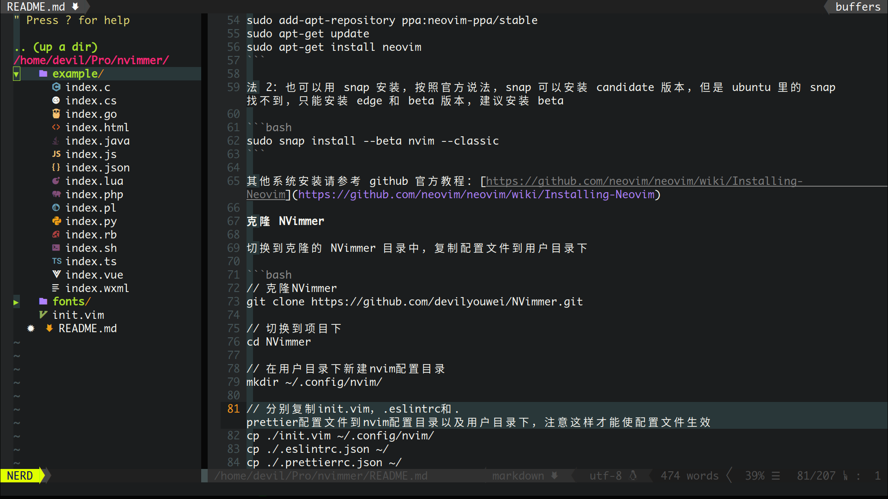

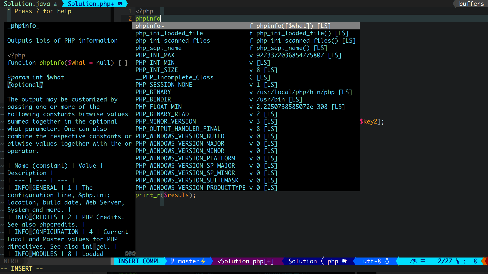

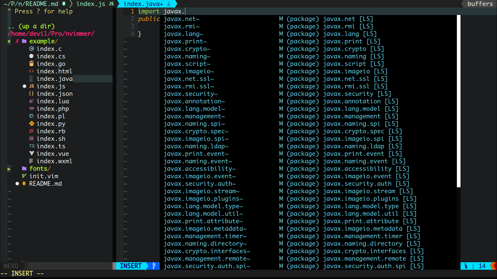

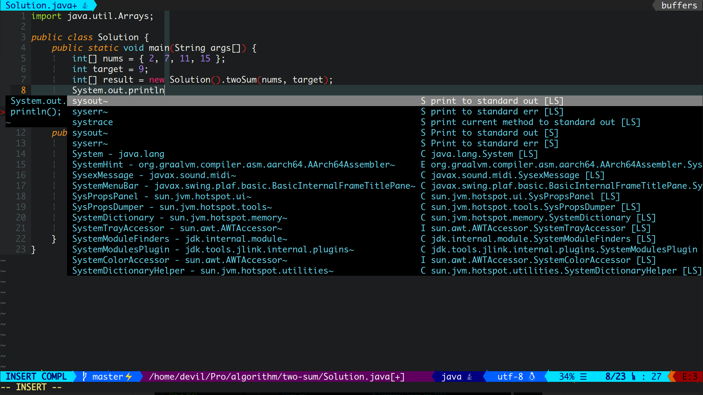

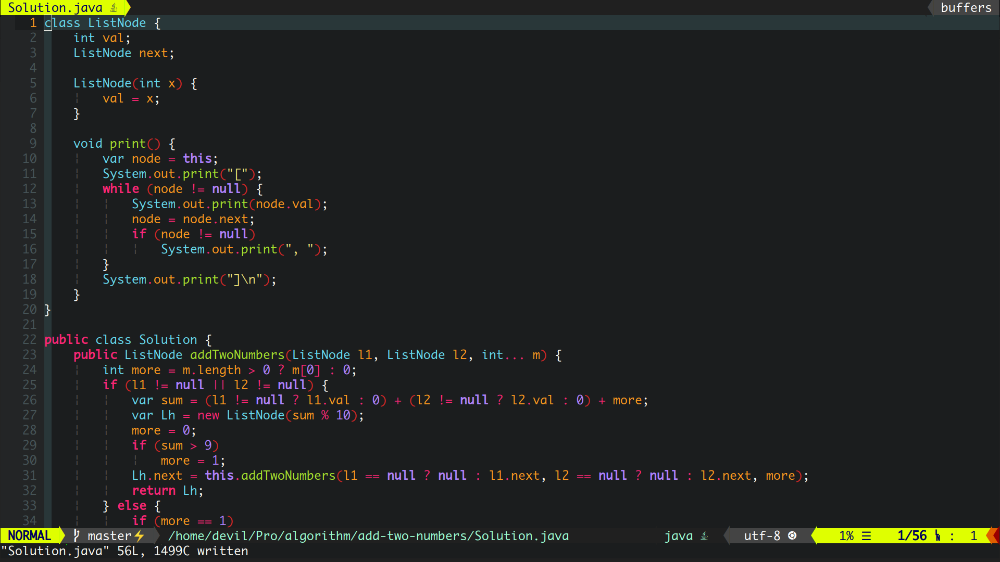

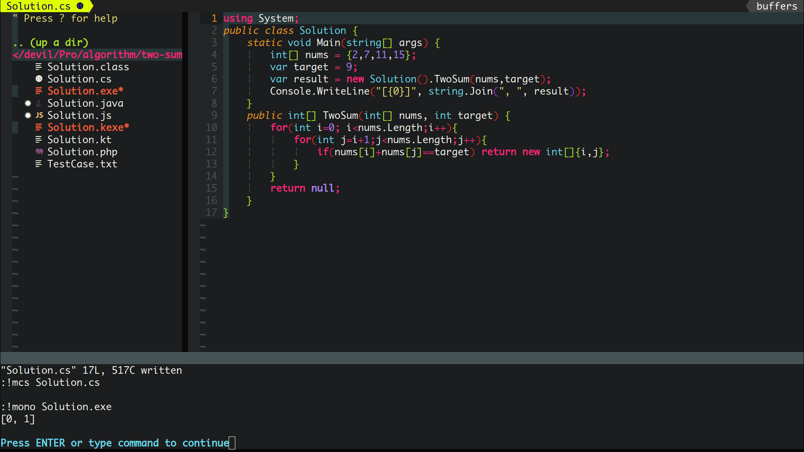

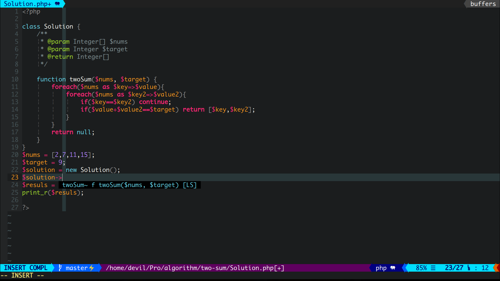

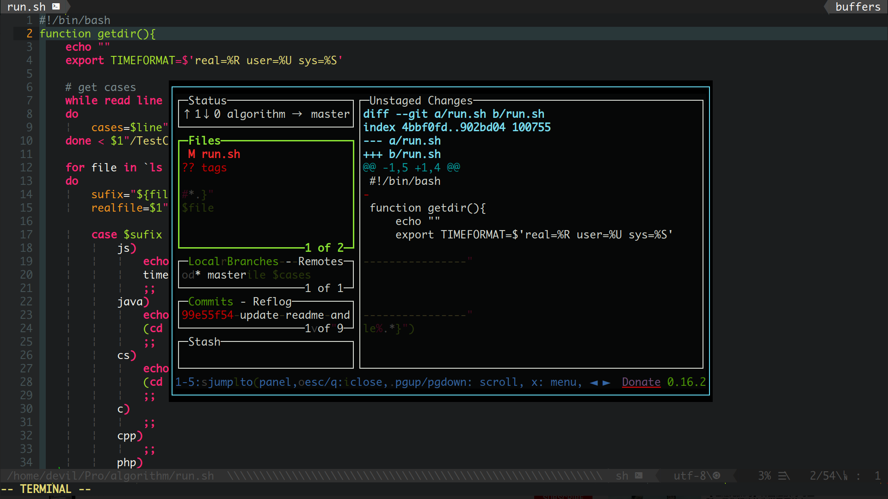

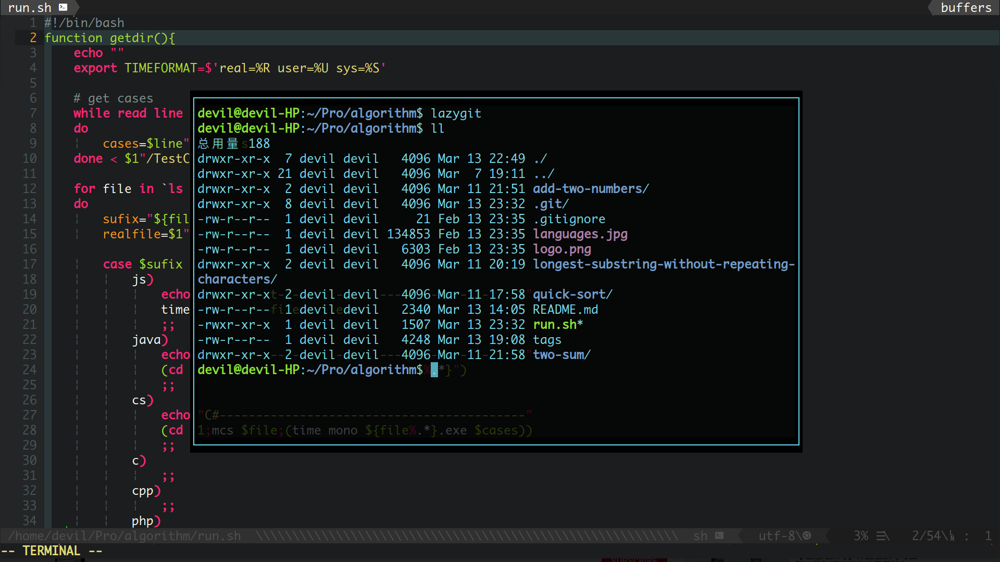

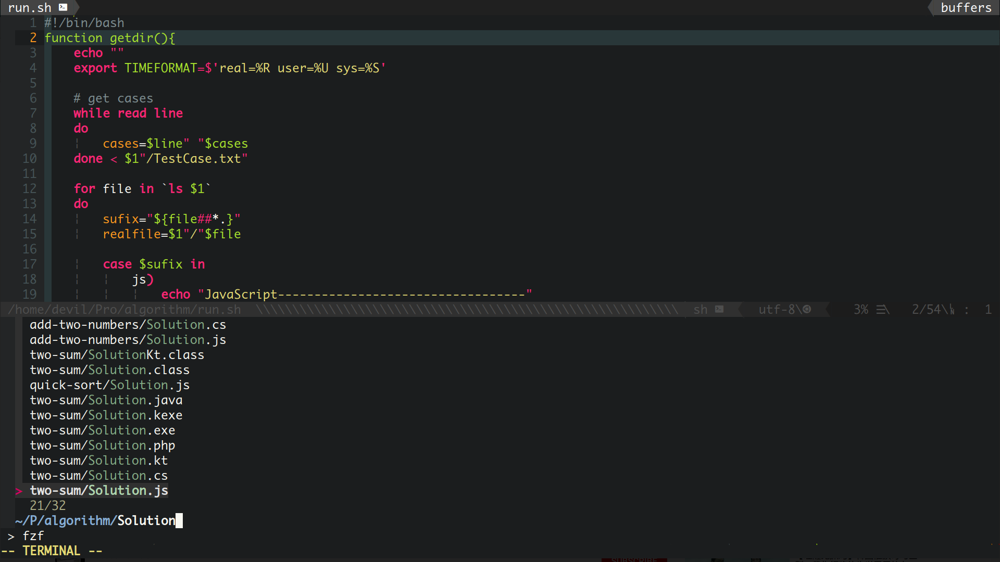


## Quick Start (Manually, Step by Step) 🔨 🔨 🔨

### Install NeoVim

Method 1: the NeoVim on Ubuntu apt is old, it is stable but never support the COC plugin.

So download the latest stable version through PPA.

```bash
sudo add-apt-repository ppa:neovim-ppa/stable
sudo apt-get update
sudo apt-get install neovim
```

Method 2 (**recommended**): you can use snap to install

```bash
sudo snap install --beta nvim --classic
```

For installation on other systems, please refer to the GitHub Tutorial:
[https://github.com/neovim/neovim/wiki/installing-neovim](https://github.com/neovim/neovim/wiki/installing-neovim)

### Clone NVimmer

For Linux

```bash
#Clone nvimmer
git clone https://github.com/devilyouwei/NVimmer.git

#Switch to project folder
cd NVimmer

#Copy nvim configuration directory to your home_user directory
mkdir ~/.config
cp -rf ./nvim/ ~/.config/
cp ./.eslintrc.json ~/
cp ./.prettierrc.json ~/
```

### Install NodeJS

I strongly **recommend** to use the tool [nvm](https://github.com/nvm-sh/nvm) to manage your nodejs!

**official node install script**

```bash
curl -sL install-node.now.sh/lts | bash
```

or

**use nvm**

```bash
curl -o- https://raw.githubusercontent.com/nvm-sh/nvm/v0.35.3/install.sh | bash

export NVM_DIR="$([ -z "${XDG_CONFIG_HOME-}" ] && printf %s "${HOME}/.nvm" || printf %s "${XDG_CONFIG_HOME}/nvm")"
[ -s "$NVM_DIR/nvm.sh" ] && \. "$NVM_DIR/nvm.sh" # This loads nvm

nvm install stable
```

The node version in ubuntu apt is too old, please refer to the node official website to install the latest version. Mine is 14 and the node official website is [https://nodejs.org](https://nodejs.org/)

Attention: **DON'T USE SNAP** to install nodejs! NeoVim `:checkhealth` not passed!

### Install vim-plug

'vim-plug' is a powerful vim plugins manager!

For Linux

```bash
curl -fLo ~/.local/share/nvim/site/autoload/plug.vim --create-dirs \
    https://raw.githubusercontent.com/junegunn/vim-plug/master/plug.vim
```

### Vim Plugin installation

Open nvim, then input command `:PlugInstall` to install all plugins

Or run in terminal

```bash
nvim -c PlugInstall
```

Note: coc-plugins will be installed automotically when you start nvim.

### Supplementary Installation

The following options can be customized for different developers, and fullstack can install all of them, which will never affect the performance.

**For node developers**

```bash
npm install -g neovim
```

**For Ruby developers**

```bash
sudo apt install ruby-dev
sudo gem install neovim
```

**For Perl**

```bash
sudo apt install cpanminus
sudo cpanm Neovim::Ext
echo 'eval $(perl -I $HOME/perl5/lib/perl5 -Mlocal::lib)' >>~/.bashrc
```

**For Python**

```bash
pip3 install neovim #py3
pip3 install neovim-remote
```

Note: never support python2 any more, include pip2

**For front-end and JS developers**

```bash
npm install -g eslint
```

1. '.eslintrc.json' and '.prettierrc.json' in home dir is the global eslint config, don't change it or add any plugin globally!

2. If you are using vue, html, react in your projects and want to lint such files. You should install the eslint plugins in **project** dir by using package.json or eslinrc.json.

Remember, put `eslint-plugin-*` only in your **project folder**, not **globally**!

**Install 'universal-ctags' for tagbar and 'astyle' for AutoFormat**

```bash
sudo apt install universal-ctags
sudo apt install astyle
sudo apt install clang-format
sudo snap install shfmt
```

**Install lazy git if needed (recommended)**

```bash
sudo add-apt-repository ppa:lazygit-team/release
sudo apt-get update
sudo apt-get install lazygit
```

## Issues

-   I want to use Monaco Nerd Fonts for my terminal. Please install the MonacoNerd.ttf in fonts

-   coc.nvim doesn't work. To ':checkhealth' in neovim and possibly your neovim is under 0.3.x, update your neovim

-   Float window doesn't work. Float window feature is added after neovim 0.4.x version. Please install the latest neovim!

## How To Use

**Quick keys**

-   **Ctrl-C, Ctrl-V, Ctrl-X** map to system clipboard, easy to copy and parse
-   Emmet HTML create tags automotically: **Ctrl-O**. Refer to 'Emmet'
-   Open Float Terminal: **F4**
-   Save: **F5**
-   Save and compile run: **F6**
-   Auto format code,document: **F12**
-   Clear blank lines: **F2**
-   Open current directory file tree: **F3**
-   Open tagbar: **F9** (ctags required)
-   Auto completion: COC auto completion, press **Tab** to auto complete
-   Buffer switch: **Ctrl+H**, **Ctrl+L**, **Ctrl+left**, **Ctrl+right**
-   Tab switch: as above, change Ctrl to **shift**
-   Find Definition of functions, classes, enter **'gd'**
-   Find tags, includeing functions, class globally, press: **Ctrl-T** or **ft**
-   Find buffers, press: **Ctrl-B** or **fb**
-   Find files in current path, press: **Ctrl-F** or **Ctrl-P** or **ff**
-   Find English words in vim, should in 'Insert Mode' and press: **Ctrl-X** then **Ctrl-W**

## My Global npm node modules

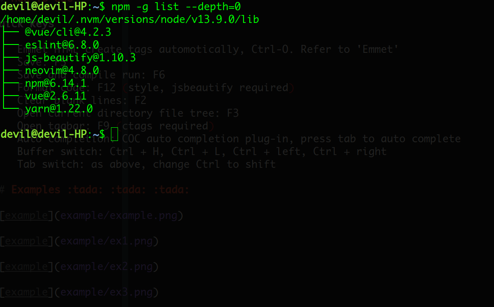
