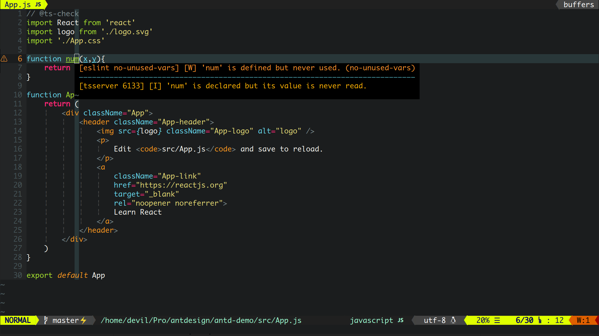

_Continuously updating..._

# NVimmer(EN)

[Chinese Readme](README_ZH.md)

A simple, fast and efficient VIM ide configuration, it is especially suitable for full stack developers.

With Monaco nerd font on Linux.

NVimmer is a new version of [Vimmer](https://github.com/devilyouwei/Vimmer). The configuration of NVimmer will be based on NeoVim instead of Vim.

**Attention: NVimmer is going to replace Vimmer.**

## Support

1. HTML CSS JS
2. Java **[color enhanced]**
3. C# **[enhanced]**
4. vue **[broken vetur LSP]**
5. TypeScript
6. PHP
7. C/C++
8. Markdown
9. JSON
10. Wechat wxml
11. react js/jsx/tsx **[new]**
12. Kotlin **[weakly support]**

Python may be supported in the future.

Vue's language server has some troubles, waiting for coc-vetur to fix it.

## Quick Start

**Install NeoVim**

Method 1: the NeoVim on Ubuntu apt is old, it is stable but never support the COC plugin.

So download the latest stable version by PPA.

```bash
sudo add-apt-repository ppa:neovim-ppa/stable
sudo apt-get update
sudo apt-get install neovim
```

Method 2: you can also use snap to install, snap can install candidate version, no stable version. You can only install edge and beta version. It is recommended to install beta

```bash
sudo snap install --beta nvim --classic
```

For installation on other systems, please refer to the GitHub tutorial:
[https://github.com/neovim/neovim/wiki/installing-neovim](https://github.com/neovim/neovim/wiki/installing-neovim)

**Clone NVimmer**

For Linux

```bash
//Clone nvimmer
git clone https://github.com/devilyouwei/NVimmer.git

//Switch to project folder
cd NVimmer

//Copy nvim configuration directory to your home_user directory
cp -rf ./nvim ~/.config/
cp ./.eslintrc.json ~/
cp ./.prettierrc.json ~/
```

**Install Nodejs**

```bash
sudo apt install nodejs
//or
curl -sL install-node.now.sh/lts | bash
```

If the node version in Ubuntu source is too old, please refer to the node official website to install the latest version. Mine is 13

I strongly recommend to use the tool [nvm](https://github.com/nvm-sh/nvm) to manage your nodejs!

[https://nodejs.org](https://nodejs.org/)

**Install vim-plug**

'vim-plug' is a powerful vim plugins manager!

For Linux

```bash
curl -fLo ~/.local/share/nvim/site/autoload/plug.vim --create-dirs \ https://raw.githubusercontent.com/junegunn/vim-plug/master/plug.vim
```

**Plugin installation**

Enter nvim, input ':plugInstall' to install all plugins

**Install coc plugins**

The following plugins are COC plugins.

For auto complete, check errors/warnings, autoformat, color highlight and other ide functions, you can choose to install them according to your main language.

The following plugins will be installed automotically when you open NeoVim(because I config them in init.vim). Of course, you can input the following commands to install them
manually again in nvim or remove them from init.vim.

```bash
:CocInstall coc-html
:CocInstall coc-eslint
:CocInstall coc-snippets
:CocInstall coc-pairs
:CocInstall coc-emmet
:CocInstall coc-java
:CocInstall coc-json
:CocInstall coc-highlight
:CocInstall coc-css
:CocInstall coc-phpls
:CocInstall coc-stylelint
:CocInstall coc-omnisharp
:CocInstall coc-prettier
//Wechat applet
:CocInstall coc-wxml
// TS and JS
:CocInstall coc-tsserver
// Vue
:CocInstall coc-vetur
:CocInstall coc-angular
```

**Supplementary Installation**

The following options can be customized for different developers, and fullstack can install all of them, which will never affect the performance.

-   For node developers

```bash
npm install -g neovim
```

-   For Ruby developers

```bash
gem install neovim
```

-   For front-end and JS developers, must install eslint!

```bash
npm install -g eslint
```

I provide only the basic 'eslint:recommended' lint rules globally in ~/.eslintrc.json and it works globally!

If you are using vue, html, react in your projects and want to lint such files.

Install the eslint-plugins(such as eslint-plugin-prettier) in the project 'node_modules' by using config files like package.json, eslintrc.json under the **project directory**, never install plugins globally by using 'npm install -g', that's useless for coc-eslint.

Remember, put eslint-plugin-\* only in your project folder, not globally!

-   Install 'Ctags' for tagbar and 'Astyle' for AutoFormat

```bash
sudo apt install ctags
sudo apt install astyle
```

## Issues

-   I want to use Monaco Nerd Fonts for my terminal, please open the font folder and install the MonacoNerd.ttf in
    FontsForLinux
-   coc.nvim doesn't work. To ':checkhealth' in neovim and possibly your neovim is under 0.3.x, update your neovim

-   Float window doesn't work. Float window feature is added after neovim 0.4.x version. Please install the latest neovim!

## How To Use

**Quick keys**

-   Emmet HTML create tags automotically, Ctrl-O. Refer to 'Emmet'
-   Save: F5
-   Save and compile run: F6
-   Format code: F12 (style, jsbeautify required)
-   Clear blank lines: F2
-   Open current directory file tree: F3
-   Open tagbar: F9 (ctags required)
-   Auto completion: COC auto completion plug-in, press tab to auto complete
-   Buffer switch: Ctrl + H, Ctrl + L, Ctrl + left, Ctrl + right
-   Tab switch: as above, change Ctrl to shift

## Examples :tada: :tada: :tada:





## My Global npm node modules


