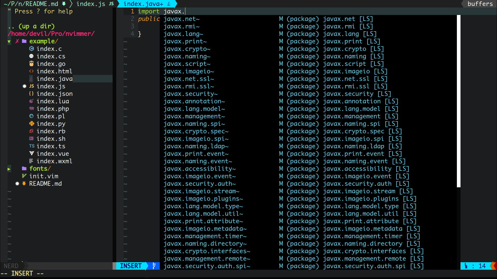
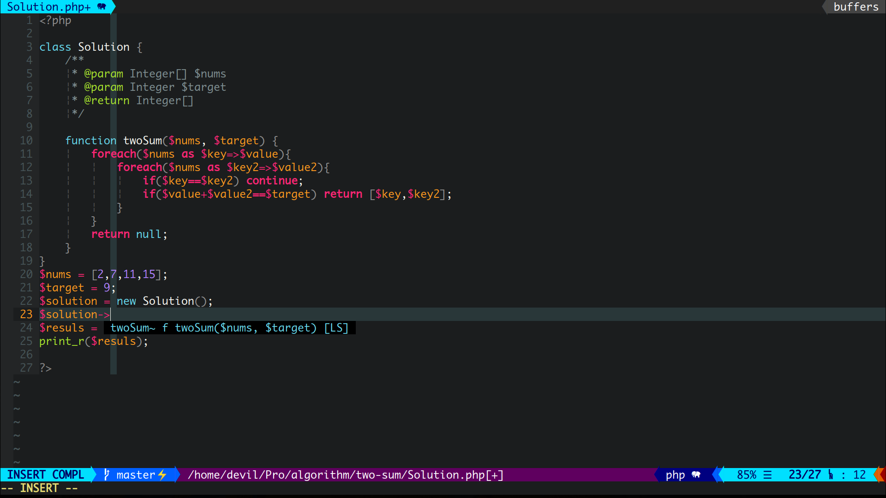
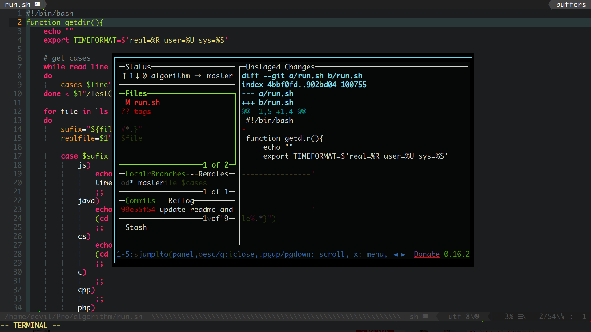

_持续更新中......_

# NVimmer(ZH)

[English Readme](README.md)

一套简洁，快速，高效的 Vim IDE 配置，适合全栈开发者。

内置 Monaco Nerd 字体

NVimmer 是新版的 [Vimmer](https://github.com/devilyouwei/Vimmer)，NVimmer 的配置将会完全基于 NeoVim 而不再是 Vim

## 适用于

1. HTML CSS JS
2. Java **[color enhanced]**
3. C# **[enhanced]**
4. vue **[broken vetur LSP]**
5. TypeScript
6. PHP
7. C/C++
8. Markdown
9. JSON
10. Wechat wxml
11. react js/jsx/tsx **[new]**
12. Kotlin **[weakly support]**
13. 英语单词 1000 多自动补全 **[new]**
14. Emoji 表情补全(输入':'后自动弹出) **[new]**

Python 在未来可能会得到支持。

Vue 的 lanaguge server 出现了一点问题, coc.nvim, coc-vetur 的创始人正在修复

## 让我们一起用 NeoVim 吧

巴西程序员 Thiago de Arruda Padilha（aka tarruda）向 Vim 开源编辑器项目递交了两大补丁，对 Vim 的架构进行了大幅调整，结果遭到了 Vim 作者 Bram Moolenaar 的拒绝，因为对于 Vim 这样一个成熟的项目进行如此大的改变风险太高。于是 tarruda 发起了 Vim fork 项目 Neovim，集资 1 万美元打造出 21 世纪的编辑器，提供更好的脚本、插件支持，整合现代的图形界面。

至今，NeoVim 的迅速崛起，大量的 vim 老用户，新用户迁移到了 Neovim 阵营。

作为 4 年多的 vim 忠实用户，在 ubuntu 上亲自尝试 NeoVim 之后，我决定使用 NeoVim 取代 Vim。

伴随之，之前的 Vimmer 项目也将停止更新，但仍然支持 bug 的修复，issue 的讨论。

未来所有的 Vim 新特性，新插件，新配置都会在 NVimmer 这个 repo 中进行。

NVimmer 将会代替 Vimmer 成为我新的，活跃的 vim 配置。

_README 使用 Vim8 写于 2020 年 2 月 15 日，纪念弃 vim，入坑 NeoVim。_

## 开始

**安装 Neovim**

法 1：ubuntu，ubuntu 自带的 neovim 比较老，但比较稳定，不支持 coc 插件，所以要用 ppa 方式下载最新稳定版。

```bash
sudo add-apt-repository ppa:neovim-ppa/stable
sudo apt-get update
sudo apt-get install neovim
```

法 2：也可以用 snap 安装，按照官方说法，snap 可以安装 candidate 版本，但是 ubuntu 里的 snap 找不到，只能安装 edge 和 beta 版本，建议安装 beta

```bash
sudo snap install --beta nvim --classic
```

其他系统安装请参考 github 官方教程：
[https://github.com/neovim/neovim/wiki/Installing-Neovim](https://github.com/neovim/neovim/wiki/Installing-Neovim)

**克隆 NVimmer**

切换到克隆的 NVimmer 目录中，复制配置文件到用户目录下

For Linux

```bash
// 克隆NVimmer
git clone https://github.com/devilyouwei/NVimmer.git

// 切换到项目下
cd NVimmer

// 在用户目录下新建nvim配置目录
cp -rf ./nvim ~/.config/

cp ./.eslintrc.json ~/
cp ./.prettierrc.json ~/
```

**安装 NodeJS**

```bash
sudo apt install nodejs
//或者
curl -sL install-node.now.sh/lts | bash
```

如果嫌 ubuntu 源里的 node 版本太老，参考 node 官网安装最新版，本人的环境是 13

墙裂推荐使用 [nvm](https://github.com/nvm-sh/nvm) 来安装和管理 nodejs，更加清洁和方便，还能随便改版本

[https://nodejs.org](https://nodejs.org/)

**安装 Vim-Plug**

Vim-Plug 是一个强大的 vim 插件管理器

Linux

```bash
curl -fLo ~/.local/share/nvim/site/autoload/plug.vim --create-dirs \ https://raw.githubusercontent.com/junegunn/vim-plug/master/plug.vim
```

**插件安装**

进入 nvim，输入:PlugInstall 安装所有插件

**Coc 插件安装**

以下插件是 Coc 安装插件，为了自动补全，自动纠错，格式化，色彩高亮等 IDE 功能准备的，可以根据自己语言需求选择安装。

打开 nvim，输入以下命令手动安装 coc 插件

(以下插件也会在 NeoVim 打开后逐个安装)

```bash
:CocInstall coc-html
:CocInstall coc-eslint
:CocInstall coc-snippets
:CocInstall coc-pairs
:CocInstall coc-emmet
:CocInstall coc-java
:CocInstall coc-json
:CocInstall coc-highlight
:CocInstall coc-css
:CocInstall coc-phpls
:CocInstall coc-stylelint
:CocInstall coc-omnisharp
:CocInstall coc-prettier
// 微信小程序
:CocInstall coc-wxml
// TS和JS
:CocInstall coc-tsserver
// vue
:CocInstall coc-vetur
:CocInstall coc-angular
```

**补充安装**

以下选装，针对不同开发者可以自己定制，fullstack 也可以全装，试了下不会影响性能

1. 针对 node 开发者

```bash
npm install -g neovim
```

2. 针对 Ruby 开发者

```bash
gem install neovim
```

3. 针对前端和 JS 开发者，全局安装 eslint

```bash
npm install -g eslint
```

针对各种先进的前端框架，例如 vue,react 等，需要其他的 lint 规则和插件，请将他们的 eslint-plugin 安装在项目目录下，不要全局安装任何 eslint 的 plugin，无效！

例如什么 eslint-plugin-prettier，也不要在系统 home 下的.eslintrc.json 中配置这些 plugin，coc-eslint 找不到他们会报错。

如需用到这些 lint 插件，正确的做法应该是在开发**项目中**配置 package.json 或者 eslintrc 文件来配置规则，然后使用'npm install'局部安装到**项目中**，

这样在项目中用 neovim 打开代码文件就会自动 lint 他们了

4. 针对 tagbar 安装 ctags，针对 autoformat 安装 astyle

```bash
sudo apt install ctags
sudo apt install astyle

# 安装lazy git (推荐)
sudo add-apt-repository ppa:lazygit-team/release
sudo apt-get update
sudo apt-get install lazygit
```

## 使用

**快捷键**

-   Emmet html 自动生成闭合 html 标签, 插入模式下按：**Ctrl-O** 参考'Emmet'官网用法
-   打开浮动终端: **F4**
-   保存: **F5**
-   保存并编译运行: **F6**
-   格式化代码：**F12**
-   清除空行: **F2**
-   打开当前目录文件树: **F3**
-   打开 Tagbar: **F9** (需要 ctags)
-   自动补全：Coc 自动补全插件，按 **Tab** 键可以自动补全
-   buffer 之间切换：**Ctrl+H**，**Ctrl+L**，**Ctrl+左键**，**Ctrl+右键**
-   Tab 切换：同上，把 Ctrl 换成 **Shift**
-   寻找函数，类的原始定义，输入 **'gd'**
-   标签全局搜索，可以搜索全局搜索函数，类，变量定义等，**normal 模式**下, 按: **Ctrl-T** 或 **ft**
-   搜索 buffers, **normal 模式**下, 按: **Ctrl-B** 或 **fb**
-   搜索当前路径下的文件, **normal 模式**下, 按: **Ctrl-F** or **Ctrl-P** 或 **ff**
-   **[new]** 在 vim 下搜索英语单词！**插入模式**下，连续按下: **Ctrl-X** **Ctrl-W**

## 问题

-   PlugInstall 安装好后打开 nvim，coc 的方法 call 不到，报错。请请检查你的 nvim 是不是低于 0.3.0，也可以输入:checkHealth 检查，请安装高于 0.3.0 的版本

-   关于浮动窗口，自动补全显示的详细文档解释小窗口，需要 0.4.0 以上的 neovim，这种情况下请使用 snap 安装，或者官网寻找安装 0.4.0
    以上的方法

-   C#的 CS 文件第一次进入会要求安装 monoserver 用于自动补全和代码检查，选择 Yes

-   Nerd 字体无法显示，nerdtree 里都是乱码和方块，该问题是因为你没有安装 nerd 字体，并把 Terminal 字体更换成 nerd 字体，建议将/font 目录下的 MonacoNerd.ttf 安装到系统中，并把 Gnome-terminal 字体改成 Monaco Nerd。苹果的 Monaco 字体真好看！

-   浮动窗口卡在那里关不掉，请使用 c-w,o 手动清楚遮挡的浮动窗口

-   格式化不喜欢，请修改 coc-setting.json 或者直接在 nvim 中输入':CocConfig'，另外.eslintrc.json 里是针对 prettier 格式化的
    设置，也可以改

-   "System limit for number of file watchers reached"

```
echo fs.inotify.max_user_watches=524288 | sudo tee -a /etc/sysctl.conf && sudo sysctl -p
sudo sysctl --system
```

## 不想说再见 :sob:

如果您是一个 Vim 的死忠粉，不想要迁移到 NeoVim，仍想要那一套精简高效的 Vim 配置，可以继续使用我的 Vimmer 的配置：

[https://github.com/devilyouwei/Vimmer](https://github.com/devilyouwei/Vimmer)

## 示例 :tada: :tada: :tada:










