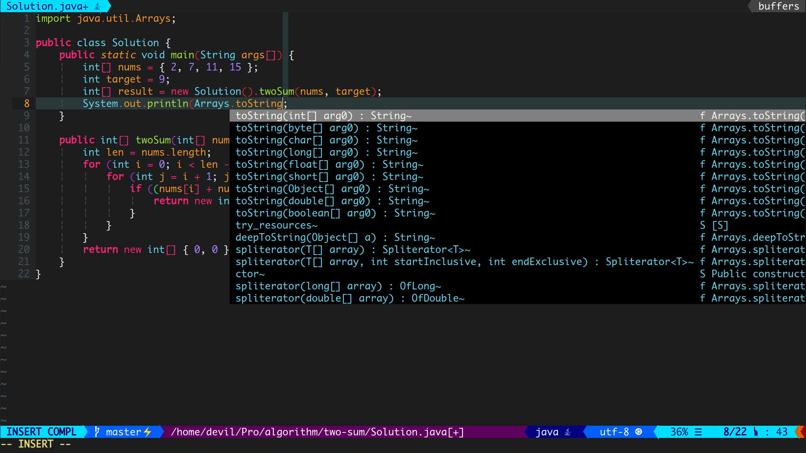
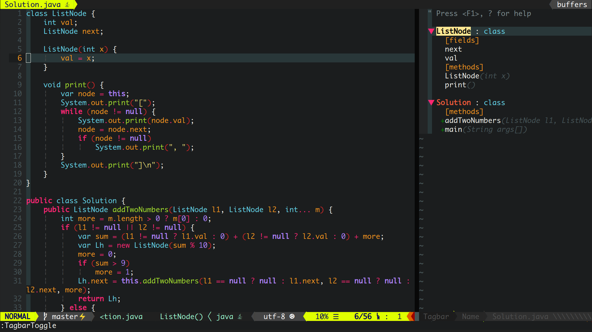
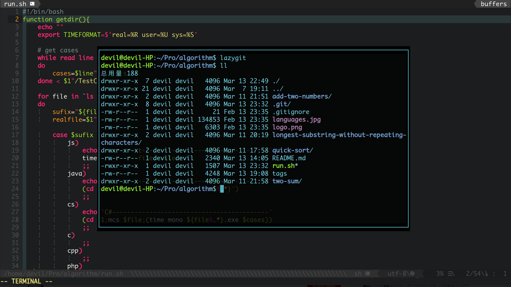
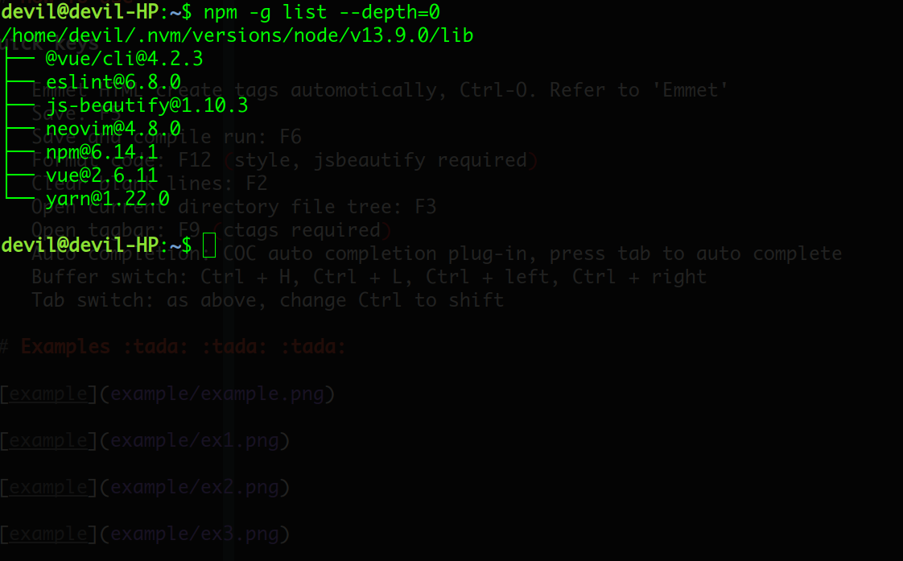

_持续更新中......_


# NVimmer(ZH)

[English Readme](README.md)

一套简洁，快速，高效的 Vim IDE 配置，适合全栈开发者。

内置 Monaco Nerd 字体！

NVimmer 是新版的 [Vimmer](https://github.com/devilyouwei/Vimmer)，NVimmer 的配置将会完全基于 NeoVim。

**Windows** [Click Here](https://github.com/devilyouwei/Vimmer)

**Mac** [iVimmer](https://github.com/husterlf/iVimmer)

## 适用于

1. HTML CSS JS **[eslint]**
2. Java **[color enhanced]**
3. C# **[enhanced]**
4. vue
5. TypeScript
6. PHP
7. C/C++ [增强]
8. Markdown
9. JSON
10. Wechat wxml
11. react js/jsx/tsx **[new]**
12. Kotlin **[weakly support]**
13. 英语单词 1000 多自动补全 **[new]**
14. Emoji 表情补全 (输入`:`后自动弹出) **[new]**

注：所有的现代前端框架的代码 format 和 lint 默认是 **prettier+eslint**！不要使用全局 eslint 了！

## 【重磅推荐】Ubuntu/Deepin Shell 脚本一键安装 🚤 🚤 🚤

执行以下命令行，省事省心的安装～ ✌

🌟 推荐使用 **curl**

```bash
curl -o ubuntu_install.sh https://raw.githubusercontent.com/devilyouwei/NVimmer/master/ubuntu_install.sh && bash ubuntu_install.sh
```

**wget**

```bash
wget https://raw.githubusercontent.com/devilyouwei/NVimmer/master/ubuntu_install.sh && bash ubuntu_install.sh
```

**安装过程出现问题** 🤔 🤔 🤔

任何脚本运行出现问题或者安装后 nvim 无法正常工作的现象出现，可以先重新启动 Terminal，如果 nvim 还是有报错，那请重新执行
安装脚本，本人的环境为 ubuntu 18.04+（干净），亲测可用，失败统统重新运行，很多东西从 github 下载会被打断或者很慢，你懂得
～

在大陆请把 pip，npm 源改成国内源

raw 无法下载的话在/etc/hosts 下添加如下：

```
199.232.28.133 raw.githubusercontent.com
```

**苹果 Monaco 字体** 🍏

用 **wget** 下载字体（必须 wget），然后直接打开 terminal 在首选项中的字体改为：`Monaco Nerd Font` 即可

你可能还需要创建一个`.fonts`目录，如果不存在的话

```bash
wget https://github.com/devilyouwei/linux-font/blob/master/Monaco/Nerd/YaheiMonacoNerd.ttf?raw=true -O ~/.fonts/MonacoNerdMono.ttf

fc-cache -vf
```

手动下载后安装

[下载 Monaco Nerd Font](https://github.com/devilyouwei/linux-font/blob/master/Monaco/Nerd/MonacoNerdMono.ttf)

## 手动开始，按部就班 🔨 🔨 🔨

### 安装 Neovim

【推荐】用 snap 安装，只能安装 edge 和 beta 版本，安装 beta

```bash
sudo snap install --beta nvim --classic
```

法 2：ubuntu 自带的 neovim 太老，不支持 coc 插件，所以要用 ppa 方式下载最新稳定版。

```bash
sudo add-apt-repository ppa:neovim-ppa/stable
sudo apt-get update
sudo apt-get install neovim
```

其他系统安装请参考 github 官方教程：
[https://github.com/neovim/neovim/wiki/Installing-Neovim](https://github.com/neovim/neovim/wiki/Installing-Neovim)

### 克隆 NVimmer

克隆 NVimmer，切换到项目下，复制配置文件到用户目录下

```bash
git clone https://github.com/devilyouwei/NVimmer.git
cd NVimmer
mkdir ~/.config
cp -rf ./nvim/ ~/.config/
cp ./.eslintrc.json ~/
cp ./.prettierrc.json ~/
```

### 安装 NodeJS

```bash
curl -sL install-node.now.sh/lts | bash
```

或者，nvm 安装（墙裂建议）

```bash
curl -o- https://raw.githubusercontent.com/nvm-sh/nvm/v0.35.3/install.sh | bash

export NVM_DIR="$([ -z "${XDG_CONFIG_HOME-}" ] && printf %s "${HOME}/.nvm" || printf %s "${XDG_CONFIG_HOME}/nvm")"
[ -s "$NVM_DIR/nvm.sh" ] && \. "$NVM_DIR/nvm.sh" # This loads nvm

nvm install stable
```

也可参考 node 官网安装最新版，本人的环境是 14

墙裂推荐使用 [nvm](https://github.com/nvm-sh/nvm) 来安装和管理 nodejs，更加清洁和方便，还能随便改版本

[https://nodejs.org](https://nodejs.org/)

注意：这里千万 **不要用 snap 安装**，无法通过 `:checkhealth` 检查

另外：nvm 在 `.bashrc` 中添加的脚本可能拖慢打开 bash 的速度

### 安装 Vim-Plug

Vim-Plug 是一个强大的 vim 插件管理器

```bash
curl -fLo ~/.local/share/nvim/site/autoload/plug.vim --create-dirs \
    https://raw.githubusercontent.com/junegunn/vim-plug/master/plug.vim
```

### 插件安装

进入 nvim，输入`:PlugInstall` 安装所有插件

或者在终端中执行：

```bash
nvim -c PlugInstall
```

注意：coc 的插件不需要手动安装，打开 nvim 会自动安装

### 其他安装

以下选装，针对不同开发者可以自己定制，fullstack 也可以全装，试了下不会影响性能

1. 针对 node 开发者

```bash
npm install -g neovim
```

注：嫌速度慢，可自行更换国内镜像源

2. 针对 Ruby 开发者

```bash
sudo apt install ruby-dev
sudo gem install neovim
```

Ruby 更换国内源

```bash
gem sources --add https://gems.ruby-china.com/ --remove https://rubygems.org/
gem sources -l
# https://gems.ruby-china.com
```

3. 针对前端和 JS 开发者，全局安装 eslint

```bash
npm install -g eslint
```

针对各种先进的前端框架，例如 vue,react 等，需要其他的 lint 规则和插件，请将他们的 eslint-plugin 安装在**项目目录**下
，**不要全局**安装任何 eslint 的 plugin！

例如什么 eslint-plugin-prettier，也不要在系统 home 下的.eslintrc.json 中配置这些 plugin，coc-eslint 找不到他们会报错。

如需用到这些 lint 插件，正确的做法应该是在开发**项目中**配置 package.json 或者 eslintrc 文件来配置规则，然后使用'npm
install'局部安装到**项目中**，

4. 针对 tagbar 安装 universal-ctags，针对 autoformat 安装 astyle

```bash
sudo apt install universal-ctags
sudo apt install astyle
sudo apt install clang-format
sudo snap install shfmt
```

5. 安装 lazy git (推荐)

```bash
sudo add-apt-repository ppa:lazygit-team/release
sudo apt-get update
sudo apt-get install lazygit
```

6. Python

```bash
pip3 install neovim
pip3 install neovim-remote
```

注意：不再支持 python2 和 pip2

7. Perl

```bash
sudo apt install cpanminus
sudo cpanm Neovim::Ext
echo 'eval $(perl -I $HOME/perl5/lib/perl5 -Mlocal::lib)' >>~/.bashrc
```

## 使用

**快捷键**

-   **Ctrl-C, Ctrl-V, Ctrl-X** 已经映射好了，可以和系统剪贴板互通，复制粘贴
-   Emmet html 自动生成闭合 html 标签, 插入模式下按： **Ctrl-O** 参考'Emmet'官网用法
-   打开浮动终端: **F4**
-   保存: **F5**
-   保存并编译运行: **F6**
-   格式化代码： **F12**
-   清除空行: **F2**
-   打开当前目录文件树: **F3**
-   打开 Tagbar: **F9** (需要 ctags)
-   自动补全：Coc 自动补全插件，按 **Tab** 键可以自动补全
-   buffer 之间切换： **Ctrl+H**， **Ctrl+L**， **Ctrl+左键**， **Ctrl+右键**
-   Tab 切换：同上，把 Ctrl 换成 **Shift**
-   寻找函数，类的原始定义，输入 **'gd'**
-   标签全局搜索，可以搜索全局搜索函数，类，变量定义等， **normal 模式**下, 按: **Ctrl-T** 或 **ft**
-   搜索 buffers, **normal 模式**下, 按: **Ctrl-B** 或 **fb**
-   搜索当前路径下的文件, **normal 模式**下, 按: **Ctrl-F** or **Ctrl-P** 或 **ff**
-   在 vim 下搜索英语单词！ **插入模式**下，连续按下: **Ctrl-X** **Ctrl-W**

## 问题

-   PlugInstall 安装好后打开 nvim，coc 的方法 call 不到，报错。请请检查你的 nvim 是不是低于 0.3.0，也可以输入
    :checkHealth 检查，请安装高于 0.3.0 的版本

-   关于开启浮动窗口，自动补全显示的详细文档的小窗口，需要 0.4.0 以上的 neovim，这种情况下请使用 snap 安装，或者官网寻找
    安装 0.4.0 以上版本的 neovim

-   C#的 CS 文件第一次进入会要求安装 monoserver 用于自动补全和代码检查，选择 Yes

-   Nerd 字体无法显示，nerdtree 里都是乱码和方块，该问题是因为你没有安装 nerd 字体，并把 Terminal 字体更换成 nerd 字体，
    建议将/font 目录下的 MonacoNerd.ttf 安装到系统中，并把 Gnome-terminal 字体改成 Monaco Nerd。苹果的 Monaco 字体真好看
    ！Windows 只能用 codenewroman nerd 字体

-   浮动窗口卡在那里关不掉，请使用 c-w,o 手动清楚遮挡的浮动窗口，目测是 neovim 的 bug，没办法

-   格式化不喜欢，请修改 coc-setting.json 或者直接在 nvim 中输入':CocConfig'，另外.eslintrc.json 里是针对 prettier 格式
    化的设置，也可以按照喜好改

-   "System limit for number of file watchers reached"

```bash
echo fs.inotify.max_user_watches=524288 | sudo tee -a /etc/sysctl.conf && sudo sysctl -p
sudo sysctl --system
```

## 不想说再见 :sob:

如果您是一个 Vim 的死忠粉，不想要迁移到 NeoVim，仍想要那一套精简高效的 Vim 配置，可以继续使用我的 Vimmer 的配置：

另外 Windows 用户，仍然推荐 Vimmer 的配置！

[https://github.com/devilyouwei/Vimmer](https://github.com/devilyouwei/Vimmer)

## 示例 :tada: :tada: :tada:










## 我全局安装的 NPM 包


